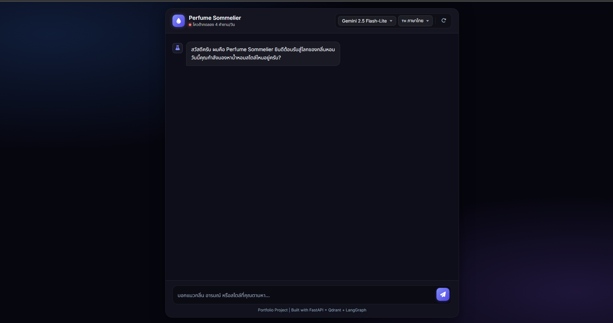
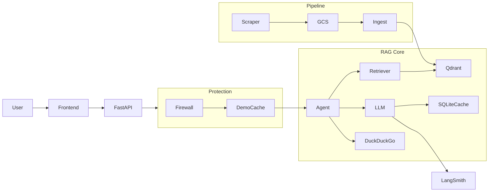
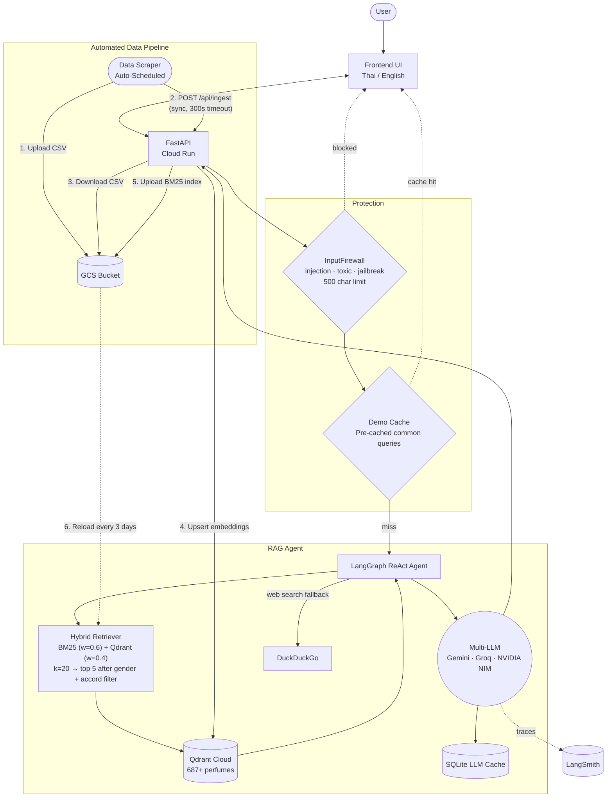

# Perfume Sommelier — RAG Chatbot

A conversational AI assistant that recommends fragrances based on natural-language descriptions of desired scent, mood, or style. Built as a production-ready RAG pipeline with hybrid search, multi-LLM routing, and a fully automated data pipeline.

> **Live Demo**: [perfume-rag-assistant-518777968420.asia-southeast3.run.app](https://perfume-rag-assistant-518777968420.asia-southeast3.run.app)

---

## Screenshot



---

## Architecture

### Overview



### Detailed Architecture



---

## Features

### AI
- **Hybrid RAG** — BM25 (weight 0.6) + Qdrant dense vector (weight 0.4) via `EnsembleRetriever`. Retrieves top 20, then applies strict gender + accord-level payload filtering, returning the best 5 results to the LLM
- **Multi-LLM Routing** — Select model from UI dropdown; each provider has a cross-provider failover chain
- **Web Search Fallback** — Falls back to DuckDuckGo for real-time queries outside the local dataset (prices, release dates, etc.)

### Reliability
- **Cross-provider Failover** — Gemini → Groq failover chain (Groq → Gemini for Groq-first selections) using LangChain `.with_fallbacks()` and `tenacity` retry
- **SQLite LLM Cache** — `SQLiteCache` via LangChain caches identical LLM calls to save API quota
- **Automatic BM25 Sync** — All Cloud Run instances pull the latest BM25 index from GCS every 3 days via `periodic_bm25_reload`. Index is also refreshed immediately after each `/api/ingest` call

### Security
- **Input Firewall** — `InputFirewall` blocks prompt injection patterns (ignore instructions, DAN, jailbreak, bypass, etc.), toxic keywords, and enforces a 500-character message limit
- **Rate Limiting** — `slowapi` caps usage at **4 requests / IP / day** for the public demo. An `INGEST_TOKEN` header is used to authenticate the internal webhook for data ingestion.

### Infrastructure
- **Cloud Run** — Containerized FastAPI backend deployed via GitHub Actions CI/CD
- **GCS** — Stores raw dataset CSV and BM25 pickle index (`langchain_docs.pkl`)
- **Automated Data Pipeline** — End-to-end: data collection → GCS → Qdrant, triggered synchronously via webhook after each scraper run

### User Experience
- **Multi-language UI** — Thai / English toggle; all strings managed in `i18n.js`
- **Stateless Conversation Memory** — Rolling chat history (last 5 turns) maintained on the client-side; server stays fully stateless and horizontally scalable

---

## Tech Stack

| Layer | Technology |
|---|---|
| Backend | FastAPI, Python 3.11 |
| Agent | LangChain, LangGraph (ReAct) |
| LLM Providers | Google Vertex AI, Groq, NVIDIA NIM |
| Vector DB | Qdrant Cloud |
| Sparse Retrieval | BM25 (`rank_bm25`) |
| Embeddings | `sentence-transformers/all-MiniLM-L6-v2` (384 dims, COSINE) |
| Cloud | Google Cloud Run, Cloud Storage (GCS) |
| Observability | LangSmith |
| Frontend | Vanilla JS, HTML5, CSS3 |

### Available Models (UI Dropdown)

| Model | Provider | Notes |
|---|---|---|
| **Gemini 2.5 Flash-Lite** ⭐ default | Vertex AI | Fastest, cheapest |
| Gemini 2.5 Flash | Vertex AI | Higher quality |
| Gemini 3.1 Flash-Lite Preview | Vertex AI | Latest preview |
| Llama 3.3 70B | Groq | Free tier, may be slow |
| Llama 4 Scout 17B | Groq | Free tier, may be slow |
| Qwen 3.6 27B | Groq | Free tier, may be slow |
| Nemotron 49B | NVIDIA NIM | May be slow |
| Llama 3.3 70B | NVIDIA NIM | May be slow |

---

## Data Pipeline

```
  Collect       Upload        Ingest        Index         Serve
    Input   ->   Cloud    ->   API      ->  Qdrant +  ->  RAG Agent
Data Scraper    GCS Bucket   /api/ingest   BM25 pkl      responds
(scheduled)     (CSV + pkl)  (sync call)
```

The scraper calls `POST /api/ingest` (with `x-diagnostic-token` header) after each run. The backend then **synchronously** downloads the latest CSV, upserts all embeddings into Qdrant, rebuilds the BM25 index, and uploads it back to GCS — keeping the connection alive to prevent Cloud Run CPU throttling.

To manually trigger ingestion:
```bash
curl -X POST "https://<your-cloud-run-url>/api/ingest" \
  -H "x-ingest-token: your_secret_token" \
  -d ""
```

---

## Project Structure

```
Perfume-RAG-Assistant/
├── src/
│   ├── main.py          # FastAPI app, routes, rate limiting, /api/ingest webhook
│   ├── llm_agent.py     # LangGraph ReAct agent, multi-LLM routing, failover
│   ├── retriever.py     # Hybrid retriever (BM25 + Qdrant), gender + accord filtering
│   ├── ingest.py        # Data pipeline: GCS download → embed → upsert Qdrant → upload BM25
│   ├── guardrails.py    # InputFirewall (prompt injection, toxic keywords, length check)
│   └── config.py        # Model registry, DEFAULT_MODEL, constants
├── frontend/
│   ├── index.html
│   ├── style.css
│   ├── script.js        # Chat UI, model selector, session management
│   └── i18n.js          # Thai / English translations
├── data/
│   └── sample_data/     # Synthetic sample CSV for local testing
├── prompts/
│   └── system_prompt.txt  # System prompt template (supports {language} variable)
├── notebooks/           # EDA and pipeline development notebooks
├── Dockerfile           # python:3.11-slim, pre-downloads embedding model at build time
├── requirements.txt
└── README.md
```

---

## Quick Start

### 1. Environment Setup

```bash
conda create -n perfume_rag python=3.11 -y
conda activate perfume_rag
pip install -r requirements.txt
```

### 2. Environment Variables

Create a `.env` file in the project root:

```env
# LLM Providers
GROQ_API_KEY="your_groq_key"
NVIDIA_API_KEY="your_nvidia_key"

# Qdrant Cloud
QDRANT_URL="https://your-cluster.cloud.qdrant.io"
QDRANT_API_KEY="your_qdrant_api_key"

# Google Cloud (Vertex AI + GCS)
GOOGLE_APPLICATION_CREDENTIALS="path/to/gcp-service-account.json"
GCP_BUCKET_NAME="your-gcs-bucket-name"

# LangSmith (optional)
LANGSMITH_TRACING=true
LANGCHAIN_API_KEY="your_langsmith_key"
LANGCHAIN_PROJECT="perfume-sommelier"

# Webhook auth token (authenticates /api/ingest)
INGEST_TOKEN="your_secret_token"
```

> [!NOTE]
> Gemini models are served via **Google Vertex AI**, not the Gemini API directly. Auth is via the service account JSON, not an API key.

### 3. Run

```bash
uvicorn src.main:app --reload
```

Open **`http://127.0.0.1:8000`**

> [!NOTE]
> The full dataset is not included. A synthetic `sample_10_rows.csv` is provided in `data/sample_data/` for local testing. Change the filename in `src/ingest.py` to use your own dataset.

---

## Future Improvements

- Add user preference profiles
- Support image-based perfume recommendations
- Replace BM25 with SPLADE for better sparse retrieval
- Automatic evaluation pipeline using RAGAS
- Streaming responses
